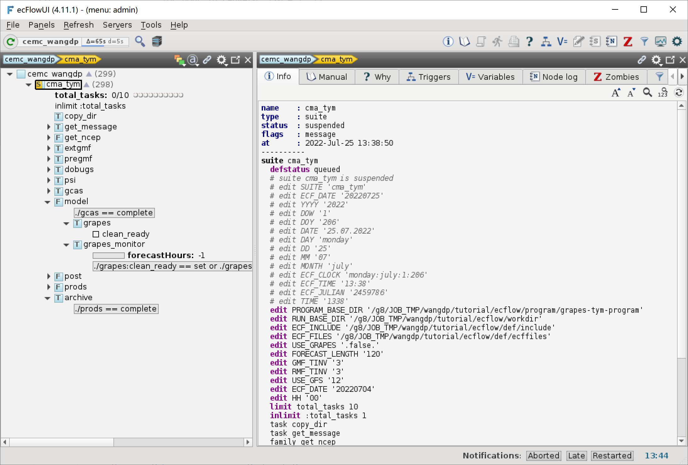

添加归档任务
=============

数值预报模式业务系统的最后一个任务通常都执行数据归档和清理工作，让我们为本教程的 CMA-TYM 模式系统添加最后一个任务。

更新工作流定义
--------------

更新 ``${TUTORIAL_HOME}/def`` 中的工作流定义文件 **cma_tym.py**：

.. code-block:: bash
    :linenos:
    :emphasize-lines: 133-135

    import os

    import ecflow

    def slurm_serial(class_name="serial"):
        variables = {
            "ECF_JOB_CMD": "slsubmit6 %ECF_JOB% %ECF_NAME% %ECF_TRIES% %ECF_TRYNO% %ECF_HOST% %ECF_PORT%",
            "ECF_KILL_CMD": "slcancel4 %ECF_RID% %ECF_NAME% %ECF_HOST% %ECF_PORT%",
    	    "CLASS": class_name,
        }
        return variables

    def slurm_parallel(nodes, tasks_per_node=32, class_name="normal"):
        variables = {
            "ECF_JOB_CMD": "slsubmit6 %ECF_JOB% %ECF_NAME% %ECF_TRIES% %ECF_TRYNO% %ECF_HOST% %ECF_PORT%",
            "ECF_KILL_CMD": "slcancel4 %ECF_RID% %ECF_NAME% %ECF_HOST% %ECF_PORT%",
            "NODES": nodes,
            "TASKS_PER_NODE": tasks_per_node,
    	    "CLASS": class_name,
        }
        return variables

    current_path = os.path.dirname(__file__)
    tutorial_base = os.path.abspath(os.path.join(current_path, "../"))
    def_path = os.path.join(tutorial_base, "def")
    ecfout_path = os.path.join(tutorial_base, "ecfout")
    program_base_dir = os.path.join(tutorial_base, "program/grapes-tym-program")
    run_base_dir = os.path.join(tutorial_base, "workdir")

    defs = ecflow.Defs()

    with defs.add_suite("cma_tym") as suite:
        suite.add_variable("PROGRAM_BASE_DIR", program_base_dir)
        suite.add_variable("RUN_BASE_DIR", run_base_dir)

        suite.add_variable("ECF_INCLUDE", os.path.join(def_path, "include"))
        suite.add_variable("ECF_FILES", os.path.join(def_path, "ecffiles"))

        suite.add_variable("USE_GRAPES", ".false.")
        suite.add_variable("FORECAST_LENGTH", 120)
        suite.add_variable("GMF_TINV", 3)
        suite.add_variable("RMF_TINV", 3)
        suite.add_variable("USE_GFS", 12)

        suite.add_variable("ECF_DATE", "20220704")
        suite.add_variable("HH", "00")

        suite.add_limit("total_tasks", 10)
        suite.add_inlimit("total_tasks")

        with suite.add_task("copy_dir") as tk_copy_dir:
            pass

        with suite.add_task("get_message") as tk_get_message:
            tk_get_message.add_trigger("./copy_dir == complete")
            tk_get_message.add_variable(slurm_serial("serial"))
            tk_get_message.add_event("arrived")
            tk_get_message.add_event("peaceful")

        with suite.add_family("get_ncep") as fm_get_ncep:
            fm_get_ncep.add_trigger("./get_message == complete")
            fm_get_ncep.add_variable(slurm_serial("serial"))
            for hour in range(0, 120 + 1, 3):
                hour_string = "{hour:03}".format(hour=hour)
                with fm_get_ncep.add_task(hour_string) as tk_hour:
                    tk_hour.add_variable("FFF", hour_string)
                    tk_hour.add_variable(
                        "ECF_SCRIPT_CMD",
                        "cat {def_path}/ecffiles/getgmf_ncep.ecf".format(def_path=def_path)
                    )

        with suite.add_task("extgmf") as tk_extgmf:
            tk_extgmf.add_trigger("./get_ncep == complete")
            tk_extgmf.add_variable(slurm_serial("serial"))

        with suite.add_task("pregmf") as tk_pregmf:
            tk_pregmf.add_trigger("./extgmf == complete")
            tk_pregmf.add_variable(slurm_serial("serial"))

        with suite.add_task("dobugs") as tk_dobugs:
            tk_dobugs.add_trigger("./pregmf == complete")
            tk_dobugs.add_variable(slurm_serial("serial"))

        with suite.add_task("psi") as tk_psi:
            tk_psi.add_trigger("./dobugs == complete")
            tk_psi.add_variable(slurm_parallel(4, 32, "normal"))

        with suite.add_task("gcas") as tk_psi:
            tk_psi.add_trigger("./psi == complete")
            tk_psi.add_variable(slurm_parallel(4, 32, "normal"))

        with suite.add_family("model") as fm_model:
            fm_model.add_trigger("./gcas == complete")
            with fm_model.add_task("grapes") as tk_grapes:
                tk_grapes.add_event("clean_ready")
                tk_grapes.add_variable(slurm_parallel(128, 32, "normal"))

            with fm_model.add_task("grapes_monitor") as tk_grapes_monitor:
                tk_grapes_monitor.add_trigger("./grapes:clean_ready == set or ./grapes == complete")
                tk_grapes_monitor.add_meter("forecastHours", -1, 120)

        with suite.add_family("post") as fm_post:
            last_hour = None
            for hour in range(0, 120 + 1, 1):
                with fm_post.add_task("post_{hour:03}".format(hour=hour)) as tk_hour:
                    trigger = "../model/grapes_monitor:forecastHours >= {hour} or ../model/grapes_monitor == complete".format(hour=hour)
                    if last_hour is not None:
                        trigger = "./post_{last_hour:03} == complete and ({trigger})".format(last_hour=last_hour, trigger=trigger)
                    tk_hour.add_trigger(trigger)
                    tk_hour.add_variable(slurm_serial("serial"))
                    tk_hour.add_variable("FFF", "{hour:03}".format(hour=hour))
                    tk_hour.add_variable(
                        "ECF_SCRIPT_CMD",
                        "cat {def_path}/ecffiles/post.ecf".format(def_path=def_path)
                    )
                last_hour = hour

        with suite.add_family("prods") as fm_prods:
            with fm_prods.add_family("plot") as fm_plot:
                for hour in range(0, 120 + 1, 1):
                    with fm_plot.add_task("plot_{hour:03}".format(hour=hour)) as tk_hour:
                        tk_hour.add_trigger("../../post/post_{hour:03} == complete".format(hour=hour))
                        tk_hour.add_variable(slurm_serial("serial"))
                        tk_hour.add_variable("FFF", "{hour:03}".format(hour=hour))
                        tk_hour.add_variable(
                            "ECF_SCRIPT_CMD",
                            "cat {def_path}/ecffiles/plot.ecf".format(def_path=def_path)
                        )

        with suite.add_task("archive") as tk_archive:
            tk_archive.add_trigger("./prods == complete")
            tk_archive.add_variable(slurm_serial("serial"))

    print(defs)
    def_output_path = str(os.path.join(def_path, "cma_tym.def"))
    defs.save_as_defs(def_output_path)

新增代码解析：

- 133-135 行添加 archive 任务，在 prods 完成后运行。

挂起 cma_tym 节点，更新 ecFlow 上的工作流：

.. code-block:: bash

    cd ${TUTORIAL_HOME}/def/ecffiles
    python cma_tym.py
    ecflow_client --port 43083 --replace /cma_tym cma_tym.def

查看 ecFlowUI：

创建任务脚本
-----------------------

本教程仅模拟归档过程，archive 任务不执行任何操作。

在 ``${TUTORIAL_HOME}/def/ecffiles`` 中创建 ecf 脚本 **archive.ecf**：

.. code-block:: bash

    #!/bin/ksh
    %include <slurm_serial.h>
    %include <head.h>
    %include <configure.h>
    #--------------------------------------

    run_dir=${CYCLE_RUN_BASE_DIR}
    cd $run_dir

    echo "ignore archive..."

    #---------------------------------------
    %include <tail.h>

.. note::

    如果不需要执行归档操作，也推荐在工作流结束时设置一个单独的任务，如我们这里使用空的 archive 任务。
    通过这个任务，我们可以很方便查看工作流运行的结束时间。
