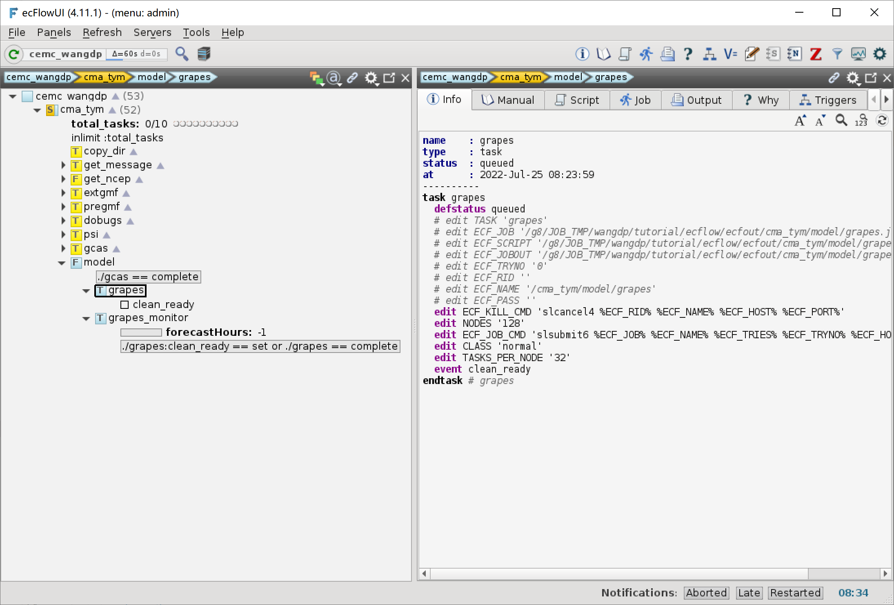

添加模式积分任务
================

从本节起，将介绍 ecFlow 的一些进阶功能。
我们将为 CMA-TYM 创建模式积分任务，并通过一个串行任务监控模式积分进度。
同时我们还将运行后处理和产品制作程序，生成发布在天气业务内网上的台风预报图形产品。

本节将创建模式积分任务和积分进度监控任务。

更新工作流定义
--------------

更新 ``${TUTORIAL_HOME}/def`` 中的工作流定义文件 **cma_tym.py**：

.. code-block:: py
    :linenos:
    :emphasize-lines: 95-103

    import os

    import ecflow

    def slurm_serial(class_name="serial"):
        variables = {
            "ECF_JOB_CMD": "slsubmit6 %ECF_JOB% %ECF_NAME% %ECF_TRIES% %ECF_TRYNO% %ECF_HOST% %ECF_PORT%",
            "ECF_KILL_CMD": "slcancel4 %ECF_RID% %ECF_NAME% %ECF_HOST% %ECF_PORT%",
    	    "CLASS": class_name,
        }
        return variables

    def slurm_parallel(nodes, tasks_per_node=32, class_name="normal"):
        variables = {
            "ECF_JOB_CMD": "slsubmit6 %ECF_JOB% %ECF_NAME% %ECF_TRIES% %ECF_TRYNO% %ECF_HOST% %ECF_PORT%",
            "ECF_KILL_CMD": "slcancel4 %ECF_RID% %ECF_NAME% %ECF_HOST% %ECF_PORT%",
            "NODES": nodes,
            "TASKS_PER_NODE": tasks_per_node,
    	    "CLASS": class_name,
        }
        return variables

    current_path = os.path.dirname(__file__)
    tutorial_base = os.path.abspath(os.path.join(current_path, "../"))
    def_path = os.path.join(tutorial_base, "def")
    ecfout_path = os.path.join(tutorial_base, "ecfout")
    program_base_dir = os.path.join(tutorial_base, "program/grapes-tym-program")
    run_base_dir = os.path.join(tutorial_base, "workdir")

    defs = ecflow.Defs()

    with defs.add_suite("cma_tym") as suite:
        suite.add_variable("PROGRAM_BASE_DIR", program_base_dir)
        suite.add_variable("RUN_BASE_DIR", run_base_dir)

        suite.add_variable("ECF_INCLUDE", os.path.join(def_path, "include"))
        suite.add_variable("ECF_FILES", os.path.join(def_path, "ecffiles"))

        suite.add_variable("USE_GRAPES", ".false.")
        suite.add_variable("FORECAST_LENGTH", 120)
        suite.add_variable("GMF_TINV", 3)
        suite.add_variable("RMF_TINV", 3)
        suite.add_variable("USE_GFS", 12)

        suite.add_variable("ECF_DATE", "20220704")
        suite.add_variable("HH", "00")

        suite.add_limit("total_tasks", 10)
        suite.add_inlimit("total_tasks")

        with suite.add_task("copy_dir") as tk_copy_dir:
            pass

        with suite.add_task("get_message") as tk_get_message:
            tk_get_message.add_trigger("./copy_dir == complete")
            tk_get_message.add_variable(slurm_serial("serial"))
            tk_get_message.add_event("arrived")
            tk_get_message.add_event("peaceful")

        with suite.add_family("get_ncep") as fm_get_ncep:
            fm_get_ncep.add_trigger("./get_message == complete")
            fm_get_ncep.add_variable(slurm_serial("serial"))
            for hour in range(0, 120 + 1, 3):
                hour_string = "{hour:03}".format(hour=hour)
                with fm_get_ncep.add_task(hour_string) as tk_hour:
                    tk_hour.add_variable("FFF", hour_string)
                    tk_hour.add_variable(
                        "ECF_SCRIPT_CMD",
                        "cat {def_path}/ecffiles/getgmf_ncep.ecf".format(def_path=def_path)
                    )

        with suite.add_task("extgmf") as tk_extgmf:
            tk_extgmf.add_trigger("./get_ncep == complete")
            tk_extgmf.add_variable(slurm_serial("serial"))

        with suite.add_task("pregmf") as tk_pregmf:
            tk_pregmf.add_trigger("./extgmf == complete")
            tk_pregmf.add_variable(slurm_serial("serial"))

        with suite.add_task("dobugs") as tk_dobugs:
            tk_dobugs.add_trigger("./pregmf == complete")
            tk_dobugs.add_variable(slurm_serial("serial"))

        with suite.add_task("psi") as tk_psi:
            tk_psi.add_trigger("./dobugs == complete")
            tk_psi.add_variable(slurm_parallel(4, 32, "normal"))

        with suite.add_task("gcas") as tk_psi:
            tk_psi.add_trigger("./psi == complete")
            tk_psi.add_variable(slurm_parallel(4, 32, "normal"))

        with suite.add_family("model") as fm_model:
            fm_model.add_trigger("./gcas == complete")
            with fm_model.add_task("grapes") as tk_grapes:
                tk_grapes.add_event("clean_ready")
                tk_grapes.add_variable(slurm_parallel(128, 32, "normal"))

            with fm_model.add_task("grapes_monitor") as tk_grapes_monitor:
                tk_grapes_monitor.add_trigger("./grapes:clean_ready == set or ./grapes == complete")
                tk_grapes_monitor.add_meter("forecastHours", -1, 120)

    print(defs)
    def_output_path = str(os.path.join(def_path, "cma_tym.def"))
    defs.save_as_defs(def_output_path)

新增代码解析：

- 95-96 行添加 model 节点，并设置触发器。
- 97-99 行添加模式积分任务 grapes，使用 128 节点，设置事件 clean_ready。
- 101-103 行添加模式积分进度监控任务 grapes_monitor，由 grapes 的 clearn_ready 事件触发，并设置标尺 forecastHours。

挂起 cma_tym 节点，更新 ecFlow 上的工作流：

.. code-block:: bash

    cd ${TUTORIAL_HOME}/def/ecffiles
    python cma_tym.py
    ecflow_client --port 43083 --replace /cma_tym cma_tym.def

查看 ecFlowUI，将已跑过的任务设为 complete 状态；

创建模式积分任务脚本
-----------------------

在 ``${TUTORIAL_HOME}/def/ecffiles`` 中创建 ecf 脚本 **grapes.ecf**：

.. code-block:: bash

    #!/bin/ksh
    %include <slurm_parallel.h>
    #SBATCH -t 00:90:00
    %include <head.h>
    %include <configure.h>
    #--------------------------------------

    run_dir=${CYCLE_RUN_DIR}
    cd $run_dir
    #===========================#
    rm -f namelist.input
    rm -f postvar${START_TIME}* post.ctl_${START_TIME}*
    rm -f sfcvar${START_TIME}* sfc.ctl_${START_TIME}*
    rm -f modelvar${START_TIME}* model.ctl_${START_TIME}*

    ecflow_client --event=clean_ready

    echo "[INFO] use cma-ncep bckg"
    echo "[INFO]  -- use grapes.exe"
    grapes_exe=${PROGRAM_BIN_DIR}/grapes.exe

    ${PROGRAM_SCRIPT_DIR}/do_grapesd01.csh \
      ${START_TIME} ${END_TIME} ${START_TIME} ${GMF_TINV} ${FORECAST_LENGTH} ${RMF_TINV}

    if [ -e qcqr_gcas_${START_TIME}00 ];then
      cat namelist.input | sed -e "s#warm_start .*=#warm_start = .T., ! #" | sed -e "s#do_cld .*=#do_cld = .T., ! #" > namelist.tmp
      mv namelist.tmp namelist.input
    fi

    #====================================
    # ulimit -s unlimited

    module load compiler/intel/composer_xe_2017.2.174
    module load mpi/intelmpi/2017.2.174

    #====================================
    unset I_MPI_PMI_LIBRARY

    ulimit -s unlimited
    ulimit -c unlimited

    srun hostname|sort|uniq|tee grapes_$SLURM_JOB_ID.hostname

    nodenum=` srun hostname|sort|uniq|wc -l `
    mpirun_perhost=30
    mpirun_np=$(expr ${nodenum} \* ${mpirun_perhost})
    mpirun -np ${mpirun_np} -f grapes_$SLURM_JOB_ID.hostname -perhost ${mpirun_perhost} ${grapes_exe}

    rm -f xb${START_TIME}006.dat
    rm -rf grapes_$SLURM_JOB_ID.hostname

    #---------------------------------------
    %include <tail.h>

创建积分进度监控任务脚本
------------------------------------

积分监控任务会逐小时检查 run 目录下对应的文件是否生成，将生成的二进制文件和 CTL 文本文件拷贝到 dat 目录中，并修改标尺 forecastHours 值，用于触发后续任务。

在 ``${TUTORIAL_HOME}/def/ecffiles`` 中创建 ecf 脚本 **grapes_monitor.ecf**：

.. code-block:: bash

    #!/bin/ksh
    %include <head.h>
    %include <configure.h>
    #--------------------------------------

    run_dir=${CYCLE_RUN_DIR}
    cd $run_dir

    forecast_length=${FORECAST_LENGTH}

    # copy post.ctl
    ctlExist=".false."
    while [ $ctlExist = ".false." ]
    do
      if [ -s post.ctl_${START_TIME} -a -s sfc.ctl_${START_TIME} ]; then
        chmod 644 post.ctl_${START_TIME} sfc.ctl_${START_TIME}
        cp post.ctl_${START_TIME} sfc.ctl_${START_TIME} ${CYCLE_DAT_DIR}/

        ctlExist=".true."
      else
        sleep 5
      fi
    done

    # copy postvar, sfcvar and sfc.ctl
    typeset -Z3 FFF
    for fhour in `seq 0 ${forecast_length} `
    do
      FFF=$fhour
      fileExist=".false."
      while [ $fileExist = ".false." ]
      do
        cd ${run_dir}
        # copy postvar and sfcvar
        if [ -s postvar${START_TIME}${FFF}00 ] && [ -s sfcvar${START_TIME}${FFF}00 ] && [ -s sfc.ctl_${START_TIME}${FFF}00 ] && [ -s model.ctl_${START_TIME}${FFF}00 ]; then
          sleep 2
          chmod 644 postvar${START_TIME}${FFF}00 sfcvar${START_TIME}${FFF}00 sfc.ctl_${START_TIME}${FFF}00 modelvar${START_TIME}${FFF}00 model.ctl_${START_TIME}${FFF}00

          cd ${CYCLE_DAT_DIR}
          cp -sf ${run_dir}/model.ctl_${START_TIME}${FFF}00 .
          cp -sf ${run_dir}/sfc.ctl_${START_TIME}${FFF}00 .
          ln -sf ${run_dir}/modelvar${START_TIME}${FFF}00  .
          ln -sf ${run_dir}/sfcvar${START_TIME}${FFF}00  .
          ln -sf ${run_dir}/postvar${START_TIME}${FFF}00 .

          ecflow_client --meter forecastHours ${fhour}
          fileExist=".true."
        else
          sleep 2
        fi
      done
    done

    #---------------------------------------
    %include <tail.h>

运行任务
---------

.. note::

    模式积分任务占用资源较多，排队和运行时间较长。
    为方便调试，等全部流程建好后我们再运行任务。