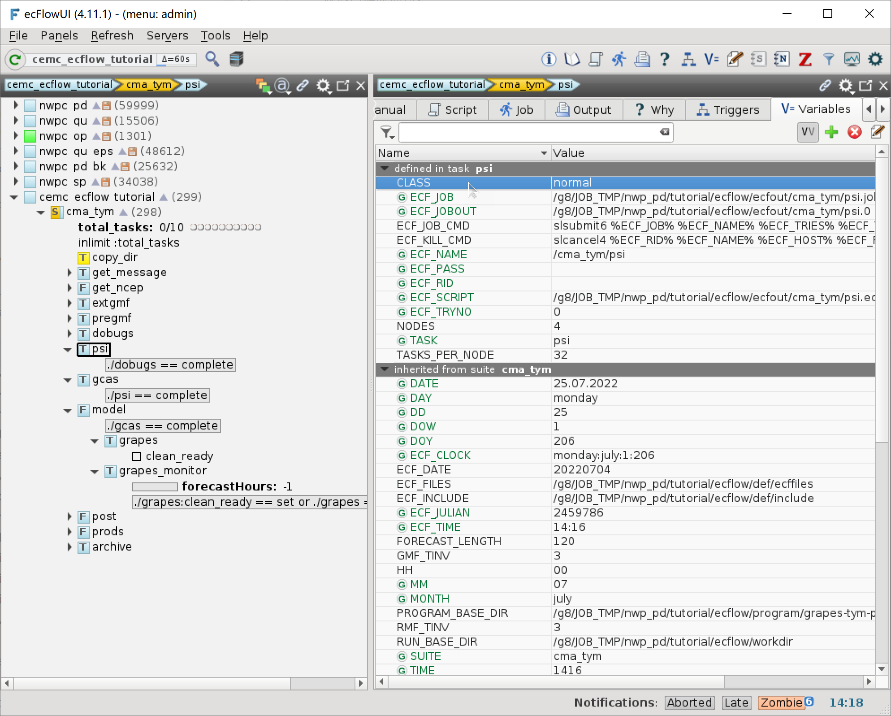
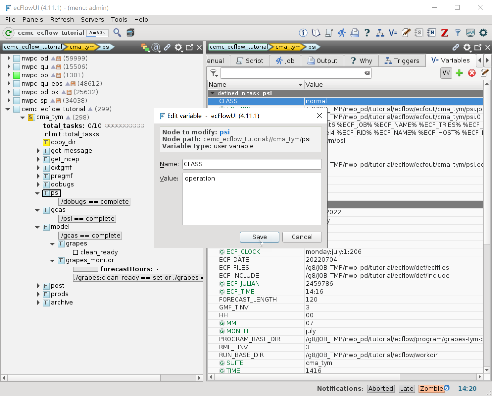
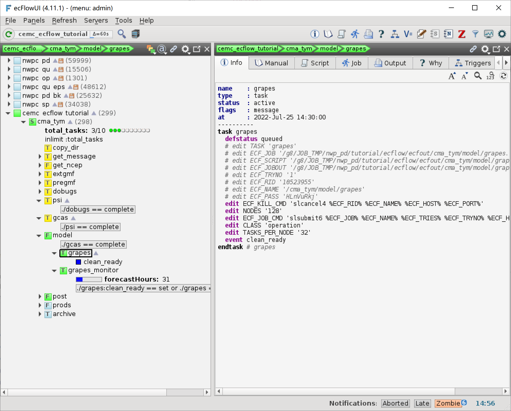
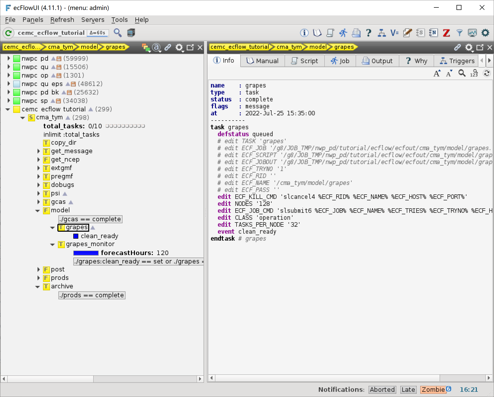
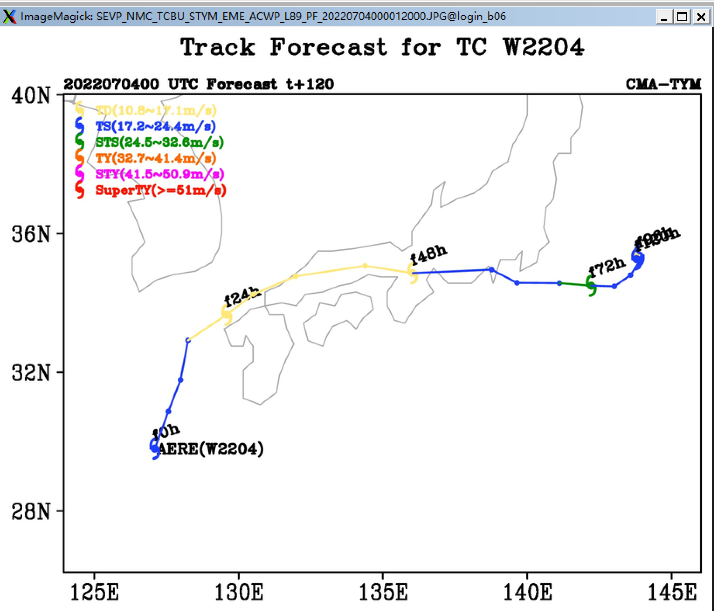

运行工作流
===========

至此，我们已经创建了一个比较完整的 CMA-TYM 模式流程，下面我们将开始实际运行整个工作流。

为了提高并行程序排队效率，本节将在业务账户 **nwp_pd** 中重新建立 CMA-TYM 工作流，并使用业务队列 **operation** 运行。

.. warning::

    个人账户请 **不要** 使用业务队列 **operation** 和 **serial_op**。

.. caution::

    业务账户请 **谨慎** 使用业务队列，避免在 **业务高峰时间段** 提交作业到业务队列。

    业务高峰时间段：

    - 中午 12:00 到下午 16:00
    - 半夜 00:00 到凌晨 04:00

建立工作流
----------

使用 nwp_pd 用户在 login_b06 节点上启动 ecFlow 服务，端口号为 43083。

根据本教程前面章节，新建（或复制）工作流定义文件、头文件、ecf 脚本文件，复制程序目录。

加载 CMA-TYM 工作流并挂起。

修改变量
---------

将并行任务 (psi, gcas, grapes) 的队列从 normal 修改为 operation，使用 ecFlowUI 修改方法如下：

点击某个并行任务 (例如 psi)，选择 Variables 标签，双击 CLASS 变量

在弹出窗口中将 Value 编辑框中的 ``normal`` 修改为 ``operation``

运行工作流
-----------

恢复 cma_tym 节点，ecFlow 会自动运行整个工作流。

所有模块运行完成后，cma_tym 节点下的所有节点都是 complete 状态。

查看图片产品
------------

查看路径预报图片：

.. code-block:: bash

    cd ${TUTORIAL_HOME}/workdir/2022070400/Prods/2022070400/tcweb
    display SEVP_NMC_TCBU_STYM_EME_ACWP_L89_PF_20220704000012000.JPG&

至此，我们已成功建立并运行 CMA-TYM 模式预报流程。