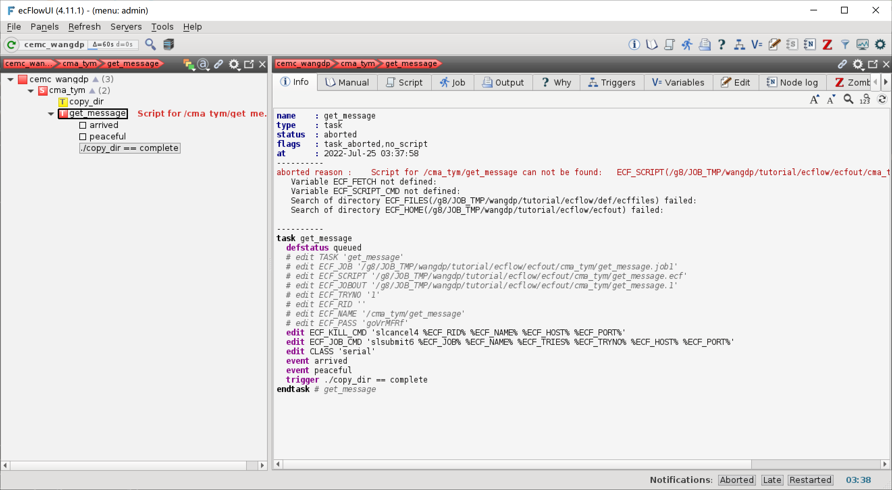
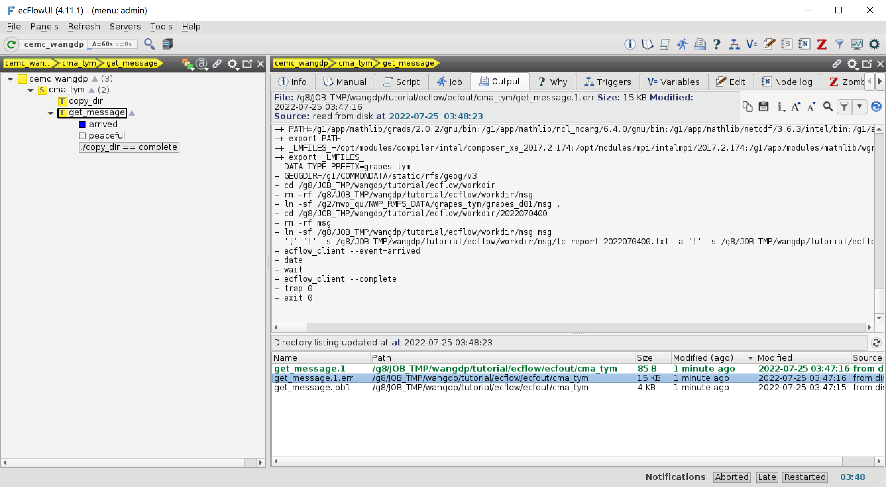

添加第二个任务
==============

下面我们开始使用 ecFlow 构建更复杂的工作流。

首先添加第二个任务 get_message，模拟从天擎和气象中心台风数据库检索台风报文的过程。

本节将介绍如何在 CMA-PI 上的串行节点上运行 ecFlow 任务。

修改工作流定义
--------------

更新 ``${TUTORIAL_HOME}/def`` 中的工作流定义文件 **cma_tym.py**：

.. code-block::
    :linenos:
    :emphasize-lines: 6-12,43-47

    import os

    import ecflow

    def slurm_serial(class_name="serial"):
        variables = {
            "ECF_JOB_CMD": "slsubmit6 %ECF_JOB% %ECF_NAME% %ECF_TRIES% %ECF_TRYNO% %ECF_HOST% %ECF_PORT%",
            "ECF_KILL_CMD": "slcancel4 %ECF_RID% %ECF_NAME% %ECF_HOST% %ECF_PORT%",
    	    "CLASS": class_name,
        }
        return variables

    current_path = os.path.dirname(__file__)
    tutorial_base = os.path.abspath(os.path.join(current_path, "../"))
    def_path = os.path.join(tutorial_base, "def")
    ecfout_path = os.path.join(tutorial_base, "ecfout")
    program_base_dir = os.path.join(tutorial_base, "program/grapes-tym-program")
    run_base_dir = os.path.join(tutorial_base, "workdir")

    defs = ecflow.Defs()

    with defs.add_suite("cma_tym") as suite:
        suite.add_variable("PROGRAM_BASE_DIR", program_base_dir)
        suite.add_variable("RUN_BASE_DIR", run_base_dir)

        suite.add_variable("ECF_INCLUDE", os.path.join(def_path, "include"))
        suite.add_variable("ECF_FILES", os.path.join(def_path, "ecffiles"))

        suite.add_variable("USE_GRAPES", ".false.")
        suite.add_variable("FORECAST_LENGTH", 120)
        suite.add_variable("GMF_TINV", 3)
        suite.add_variable("RMF_TINV", 3)
        suite.add_variable("USE_GFS", 12)

        suite.add_variable("ECF_DATE", "20220704")
        suite.add_variable("HH", "00")

        with suite.add_task("copy_dir") as tk_copy_dir:
            pass

        with suite.add_task("get_message") as tk_get_message:
            tk_get_message.add_trigger("./copy_dir == complete")
            tk_get_message.add_variable(slurm_serial("serial"))
            tk_get_message.add_event("arrived")
            tk_get_message.add_event("peaceful")

    print(defs)
    def_output_path = str(os.path.join(def_path, "cma_tym.def"))
    defs.save_as_defs(def_output_path)

新增代码说明：

* 6-12 行：定义函数 ``slurm_serial``，定义了提交 SLURM 串行作业需要的一些 ecFlow 变量：
    - ``ECF_JOB_CMD``：提交作业脚本的命令
    - ``ECF_KILL_CMD``：终止作业脚本运行的命令
    - ``CLASS``：队列名，会在 include 头文件中使用
* 43-47 行：定义一个新任务 get_message，设置触发条件，copy_dir 任务结束后才开始运行，同时还设置了两个事件
    - ``arrived`` 表示有台风
    - ``peaceful`` 表示没有台风

运行 **cma_tym.py** 脚本，生成新的 **cma_tym.def** 文件：

.. code-block:: bash

    python cma_tym.py

新 cma_tym.def 文件如下：

.. code-block::

    # 4.11.1
    suite cma_tym
      edit PROGRAM_BASE_DIR '/g8/JOB_TMP/wangdp/tutorial/ecflow/program/grapes-tym-program'
      edit RUN_BASE_DIR '/g8/JOB_TMP/wangdp/tutorial/ecflow/workdir'
      edit ECF_INCLUDE '/g8/JOB_TMP/wangdp/tutorial/ecflow/def/include'
      edit ECF_FILES '/g8/JOB_TMP/wangdp/tutorial/ecflow/def/ecffiles'
      edit USE_GRAPES '.false.'
      edit FORECAST_LENGTH '120'
      edit GMF_TINV '3'
      edit RMF_TINV '3'
      edit USE_GFS '12'
      edit ECF_DATE '20220704'
      edit HH '00'
      task copy_dir
      task get_message
        trigger ./copy_dir == complete
        edit ECF_KILL_CMD 'slcancel4 %ECF_RID% %ECF_NAME% %ECF_HOST% %ECF_PORT%'
        edit ECF_JOB_CMD 'slsubmit6 %ECF_JOB% %ECF_NAME% %ECF_TRIES% %ECF_TRYNO% %ECF_HOST% %ECF_PORT%'
        edit CLASS 'serial'
        event arrived
        event peaceful
    endsuite
    # enddef

更新工作流
-----------

运行 cma_tym.py 生成新的 def 文件不会自动更新 ecFlow 服务里的工作流，需要手动将 def 文件加载到 ecFlow 服务中。

当我们直接使用 ecflow_client 加载 def 文件时，会报错：

.. code-block:: bash

    cd ${TUTORIAL_HOME}/def
    ecflow_client --port 43083 --load cma_tym.def

报错信息如下：

.. code-block::

    Error: request( --load=cma_tym.def  :wangdp ) failed!  Server replied with: 'Add Suite failed: A Suite of name 'cma_tym' already exist'

提示已经存在名为 cma_tym 的 suite，无法加载 def 文件。

这种情况下，我们可以使用 ``replace`` 命令替换 ecFlow 服务中已加载的工作流。

.. code-block:: bash

    ecflow_client --port 43083 --replace /cma_tym cma_tym.def

在 ecFlowUI 界面中查看新添加的任务。
重新加载工作流定义后，suite 会立即运行，copy_dir 运行成功，但因为没有编写 get_message 脚本，所以 get_message 任务会报错：

ecFlowUI 中也可以直接看到我们为 get_message 添加的触发器。

.. note::

    如果不希望重新加载工作流后任务自动运行，可以将 suite 节点 cma_tym 挂起 (suspend)。
    处于挂起状态下的工作流不会自动运行任务。

    右键单击 cma_tym，选择 Suspend。

    .. image:: image/ecflow-ui-suspend-suite.png

创建头文件
-----------

为使用串行队列的任务创建一个头文件，包含提交串行作业需要的 Slurm 指令。

在 ``${TUTORIAL_HOME}/def/include`` 中创建头文件 **slurm_serial.h**：

.. code-block:: bash

    ## This is a head file for Slurm serial job.
    #SBATCH -J GRAPES
    #SBATCH -p %CLASS%
    #SBATCH -o %ECF_JOBOUT%
    #SBATCH -e %ECF_JOBOUT%.err
    #SBATCH --comment=GRAPES
    #SBATCH -t 00:60:00
    #SBATCH --no-requeue

创建任务脚本
------------

在 ``${TUTORIAL_HOME}/def/ecffiles`` 中创建 ecf 脚本 **get_message.ecf**：

.. code-block:: bash

    #!/bin/bash
    %include <slurm_serial.h>
    %include <head.h>
    %include <configure.h>
    #--------------------------------------

    #-------------------
    cd ${RUN_BASE_DIR}
    rm -rf ${MSG_DIR}
    ln -sf /g2/nwp_qu/NWP_RMFS_DATA/grapes_tym/grapes_d01/msg .

    cd ${CYCLE_RUN_BASE_DIR}
    rm -rf msg
    ln -sf ${MSG_DIR} msg

    if [ ! -s ${MSG_DIR}/tc_report_${START_TIME}.txt -a ! -s ${MSG_DIR}/tc_message_global_${START_TIME} ] ;then
      ecflow_client --event=peaceful
    else
      ecflow_client --event=arrived
    fi

    #---------------------------------------
    %include <tail.h>

.. note::

    上述脚本将 CMA-TYM 业务系统的台风报文目录链接到运行目录，模拟台风报文检索过程。
    实际业务系统会从天擎和 NMC 台风数据库检索台风报文，并进行预处理。

在 ecFlowUI 上查看运行结果：

get_message 任务检查到有台风报文，所以设置了事件 arrived。