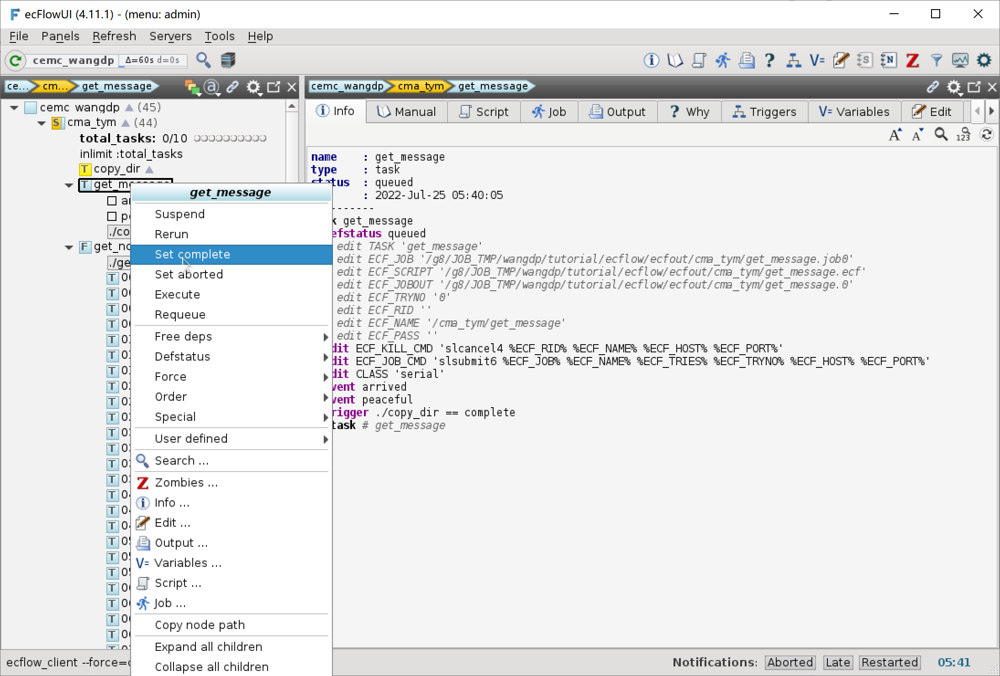
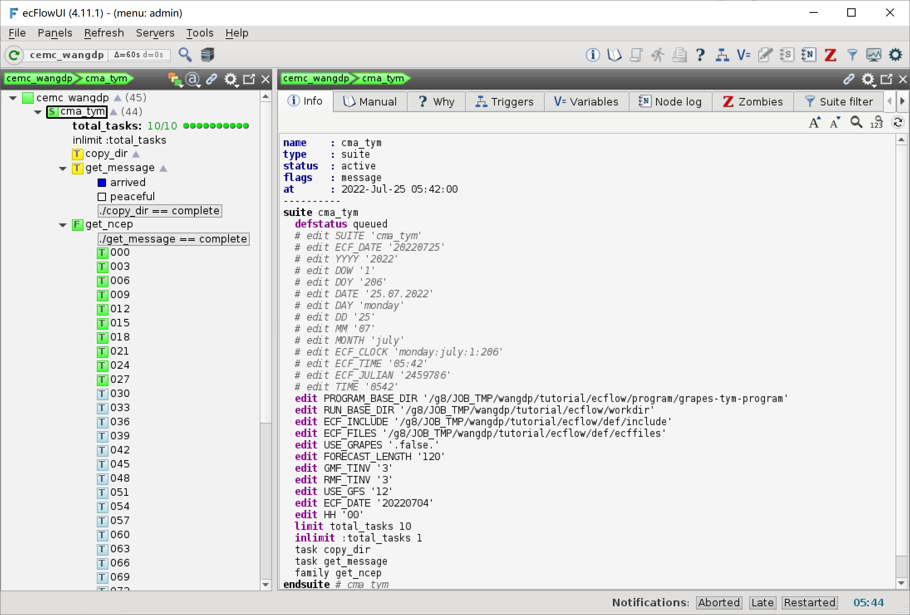

添加 Family
=============

接下来添加一组处理 NCEP GFS 预报数据的任务，为 CMA-TYM 生成背景场数据。
下面将创建 Family 节点 get_ncep，为 0 到 120 小时每隔 3 小时创建一个数据预处理任务。

修改工作流定义
--------------

更新 ``${TUTORIAL_HOME}/def`` 中的工作流定义文件 **cma_tym.py**：

.. code-block:: py
    :linenos:
    :emphasize-lines: 40-41,52-62

    import os

    import ecflow

    def slurm_serial(class_name="serial"):
        variables = {
            "ECF_JOB_CMD": "slsubmit6 %ECF_JOB% %ECF_NAME% %ECF_TRIES% %ECF_TRYNO% %ECF_HOST% %ECF_PORT%",
            "ECF_KILL_CMD": "slcancel4 %ECF_RID% %ECF_NAME% %ECF_HOST% %ECF_PORT%",
    	    "CLASS": class_name,
        }
        return variables

    current_path = os.path.dirname(__file__)
    tutorial_base = os.path.abspath(os.path.join(current_path, "../"))
    def_path = os.path.join(tutorial_base, "def")
    ecfout_path = os.path.join(tutorial_base, "ecfout")
    program_base_dir = os.path.join(tutorial_base, "program/grapes-tym-program")
    run_base_dir = os.path.join(tutorial_base, "workdir")

    defs = ecflow.Defs()

    with defs.add_suite("cma_tym") as suite:
        suite.add_variable("PROGRAM_BASE_DIR", program_base_dir)
        suite.add_variable("RUN_BASE_DIR", run_base_dir)

        suite.add_variable("ECF_INCLUDE", os.path.join(def_path, "include"))
        suite.add_variable("ECF_FILES", os.path.join(def_path, "ecffiles"))

        suite.add_variable("USE_GRAPES", ".false.")
        suite.add_variable("FORECAST_LENGTH", 120)
        suite.add_variable("GMF_TINV", 3)
        suite.add_variable("RMF_TINV", 3)
        suite.add_variable("USE_GFS", 12)

        suite.add_variable("ECF_DATE", "20220704")
        suite.add_variable("HH", "00")

        suite.add_limit("total_tasks", 10)
        suite.add_inlimit("total_tasks")

        with suite.add_task("copy_dir") as tk_copy_dir:
            pass

        with suite.add_task("get_message") as tk_get_message:
            tk_get_message.add_trigger("./copy_dir == complete")
            tk_get_message.add_variable(slurm_serial("serial"))
            tk_get_message.add_event("arrived")
            tk_get_message.add_event("peaceful")

        with suite.add_family("get_ncep") as fm_get_ncep:
            fm_get_ncep.add_trigger("./get_message == complete")
            fm_get_ncep.add_variable(slurm_serial("serial"))
            for hour in range(0, 120 + 1, 3):
                hour_string = "{hour:03}".format(hour=hour)
                with fm_get_ncep.add_task(hour_string) as tk_hour:
                    tk_hour.add_variable("FFF", hour_string)
                    tk_hour.add_variable(
                        "ECF_SCRIPT_CMD",
                        "cat {def_path}/ecffiles/getgmf_ncep.ecf".format(def_path=def_path)
                    )

    print(defs)
    def_output_path = str(os.path.join(def_path, "cma_tym.def"))
    defs.save_as_defs(def_output_path)

40-41 行创建一个 Limit，并将该 Limit 应用到 cma_tym 节点上，限制同时运行的任务不能超过 10 个。

.. note::

    对于需要运行大量任务的工作流，一定要限制同时运行的任务数，避免同一时间大量提交作业导致 ecFlow 服务卡死。

52-62 行创建 Family 节点 get_ncep，逐三小时创建以三位时效数字作为名称的任务。

任务通过 ``ECF_SCRIPT_CMD`` 变量设置任务对应的 ecf 脚本，ecFlow 会将 ``ECF_SCRIPT_CMD`` 命令的输出作为该任务的 ecf 脚本。

更新工作流
-----------

与前一节一样，需要重新生成 def 文件并更新到 ecFlow 服务中。
在更新之前，我们先在 ecFlowUI 中将 cma_tym 节点挂起，避免更新后系统提交大量作业。

更新工作流：

.. code-block:: bash

    cd ${TUTORIAL_HOME}/def
    python cma_tym.py
    ecflow_client --port 43083 --replace /cma_tym cma_tym.def

为了节省时间，我们可以将之前已跑过的任务强制设为完成状态 (complete)，也可以手动设置事件。
比如，右键单击 copy_dir 任务，选择 Set complete，会将 get_message 任务强制设为 complete 状态。

创建任务脚本
------------

在 ``${TUTORIAL_HOME}/def/ecffiles`` 目录下创建 ecf 脚本 **getgmf_ncep.ecf**：

.. code-block:: bash

    #!/bin/ksh
    %include <slurm_serial.h>
    %include <head.h>
    %include <configure.h>
    #--------------------------------------
    # common variables
    endian="little_endian"
    res=0p50

    # ecflow variables
    TTT=%FFF%

    # time
    BDYTIME=${START_TIME}
    BDYDATE=$(echo $BDYTIME |cut -c1-8)
    BDYYYYY=$(echo $BDYTIME |cut -c1-4)
    BDYHH=$(echo $BDYTIME |cut -c9-10)
    REALTIME=$(smsdate $BDYTIME +${TTT})

    # directory
    NCEP_GFS_SRC_DIR=/g1/COMMONDATA/glob/gfs/${BDYYYYY}/gfs.$BDYTIME

    NCEP_GFS_LOCAL_DIR=${CYCLE_GMF_DIR}/${START_TIME}
    dataproc_dir=${CYCLE_GMF_DIR}/data_proc
    bckg_dir=${CYCLE_RUN_DIR}/bckg_data

    #----------------------------
    RUN_DIR=${CYCLE_GMF_DIR}
    cd ${RUN_DIR}

    test -d ${NCEP_GFS_LOCAL_DIR} || mkdir -p ${NCEP_GFS_LOCAL_DIR}
    test -d ${dataproc_dir}/$TTT || mkdir -p ${dataproc_dir}/$TTT

    gfsfile=${NCEP_GFS_LOCAL_DIR}/${TTT}/gfs.t${BDYHH}z.pgrb2.${res}.f${TTT}
    gfsprefix=gfs.t${BDYHH}z.pgrb2.${res}
    gfsfhour=${TTT}

    # check NCEP data
    if [ ! -f ${NCEP_GFS_SRC_DIR}/gfs.t${BDYHH}z.pgrb2.${res}.f${TTT} ]; then
        echo "NO NCEP GFS data"
        this_is_an_error
    fi

    mkdir -p ${NCEP_GFS_LOCAL_DIR}/${TTT}
    cd ${NCEP_GFS_LOCAL_DIR}/${TTT}
    cp ${NCEP_GFS_SRC_DIR}/gfs.t${BDYHH}z.pgrb2.${res}.f${TTT} .

    #------------------------------------
    # preprocess gfs data
    cd ${dataproc_dir}/$TTT

    wgrib2  -s $gfsfile \
        | egrep -v ":TMP:0.4 mb:|:HGT:0.4 mb:|:TMP:15 mb:|:HGT:15 mb:|:TMP:40 mb:|:HGT:40 mb:" \
        | wgrib2 -i $gfsfile -GRIB ./$( basename ${gfsfile} )

    ln -sf ${PROGRAM_BIN_DIR}/newdate .
    ln -sf ${PROGRAM_BIN_DIR}/read_for_grapes.exe .
    ln -sf ${PROGRAM_SCRIPT_DIR}/grib2bin.sh.meso grib2bin.sh

    ./grib2bin.sh $(pwd)/${gfsprefix}.f*[FF] ${endian} ${gfsfhour} 3 ${gfsfhour}

    mv ${dataproc_dir}/$TTT/bckg_$REALTIME ${bckg_dir}

    # copy namelist
    if [ `expr $TTT` -eq 0 ];then
        cp namelist.grib ${dataproc_dir}
    fi

    if [ ${TTT} = "000" ]; then
      cd ${bckg_dir}
      cp ModelName_gfs.txt ModelName.txt
    fi

    #---------------------------------------
    %include <tail.h>

该脚本从当前预报时次的 NCEP GFS GRIB2 数据文件中提取背景场信息，生成 ``bckg_YYYYMMDDHH`` 文件，存放到 bckg 目录中。

运行任务
---------

创建脚本后，可以恢复 cma_tym 自动运行。
右键单击 cma_tym，选择 Resume，恢复工作流运行。可以看到 get_ncep 下面前 10 个作业开始运行：

因为我们创建的 Limit (total_tasks) 限制最多运行 10 个任务，所以有 1 个任务运行结束后第 11 个任务才会自动运行。

查看 bckg 目录，检查背景场文件是否生成：

.. code-block:: bash

    cd ${TUTORIAL_HOME}/workdir/2022070400/run/bckg_data
    ls -l bckg_2022*

.. code-block::

    -rw-r--r-- 1 wangdp nop 150754760 Jul 25 05:44 bckg_2022070400
    -rw-r--r-- 1 wangdp nop 150754760 Jul 25 05:45 bckg_2022070403
    -rw-r--r-- 1 wangdp nop 150754760 Jul 25 05:44 bckg_2022070406
    -rw-r--r-- 1 wangdp nop 150754760 Jul 25 05:44 bckg_2022070409
    -rw-r--r-- 1 wangdp nop 150754760 Jul 25 05:44 bckg_2022070412
    -rw-r--r-- 1 wangdp nop 150754760 Jul 25 05:45 bckg_2022070415
    -rw-r--r-- 1 wangdp nop 150754760 Jul 25 05:45 bckg_2022070418
    -rw-r--r-- 1 wangdp nop 150754760 Jul 25 05:45 bckg_2022070421
    -rw-r--r-- 1 wangdp nop 150754760 Jul 25 05:45 bckg_2022070500
    -rw-r--r-- 1 wangdp nop 150754760 Jul 25 05:45 bckg_2022070503
    -rw-r--r-- 1 wangdp nop 150754760 Jul 25 05:45 bckg_2022070506
    -rw-r--r-- 1 wangdp nop 150754760 Jul 25 05:45 bckg_2022070509
    -rw-r--r-- 1 wangdp nop 150754760 Jul 25 05:45 bckg_2022070512
    -rw-r--r-- 1 wangdp nop 150754760 Jul 25 05:45 bckg_2022070515
    -rw-r--r-- 1 wangdp nop 150754760 Jul 25 05:45 bckg_2022070518
    -rw-r--r-- 1 wangdp nop 150754760 Jul 25 05:45 bckg_2022070521
    -rw-r--r-- 1 wangdp nop 150754760 Jul 25 05:45 bckg_2022070600
    -rw-r--r-- 1 wangdp nop 150754760 Jul 25 05:45 bckg_2022070603
    -rw-r--r-- 1 wangdp nop 150754760 Jul 25 05:45 bckg_2022070606
    -rw-r--r-- 1 wangdp nop 150754760 Jul 25 05:45 bckg_2022070609
    -rw-r--r-- 1 wangdp nop 150754760 Jul 25 05:45 bckg_2022070612
    -rw-r--r-- 1 wangdp nop 150754760 Jul 25 05:45 bckg_2022070615
    -rw-r--r-- 1 wangdp nop 150754760 Jul 25 05:45 bckg_2022070618
    -rw-r--r-- 1 wangdp nop 150754760 Jul 25 05:45 bckg_2022070621
    -rw-r--r-- 1 wangdp nop 150754760 Jul 25 05:45 bckg_2022070700
    -rw-r--r-- 1 wangdp nop 150754760 Jul 25 05:45 bckg_2022070703
    -rw-r--r-- 1 wangdp nop 150754760 Jul 25 05:45 bckg_2022070706
    -rw-r--r-- 1 wangdp nop 150754760 Jul 25 05:45 bckg_2022070709
    -rw-r--r-- 1 wangdp nop 150754760 Jul 25 05:45 bckg_2022070712
    -rw-r--r-- 1 wangdp nop 150754760 Jul 25 05:45 bckg_2022070715
    -rw-r--r-- 1 wangdp nop 150754760 Jul 25 05:45 bckg_2022070718
    -rw-r--r-- 1 wangdp nop 150754760 Jul 25 05:45 bckg_2022070721
    -rw-r--r-- 1 wangdp nop 150754760 Jul 25 05:45 bckg_2022070800
    -rw-r--r-- 1 wangdp nop 150754760 Jul 25 05:45 bckg_2022070803
    -rw-r--r-- 1 wangdp nop 150754760 Jul 25 05:45 bckg_2022070806
    -rw-r--r-- 1 wangdp nop 150754760 Jul 25 05:45 bckg_2022070809
    -rw-r--r-- 1 wangdp nop 150754760 Jul 25 05:45 bckg_2022070812
    -rw-r--r-- 1 wangdp nop 150754760 Jul 25 05:45 bckg_2022070815
    -rw-r--r-- 1 wangdp nop 150754760 Jul 25 05:45 bckg_2022070818
    -rw-r--r-- 1 wangdp nop 150754760 Jul 25 05:45 bckg_2022070821
    -rw-r--r-- 1 wangdp nop 150754760 Jul 25 05:45 bckg_2022070900
