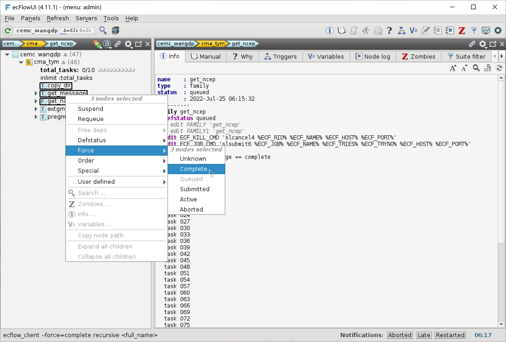
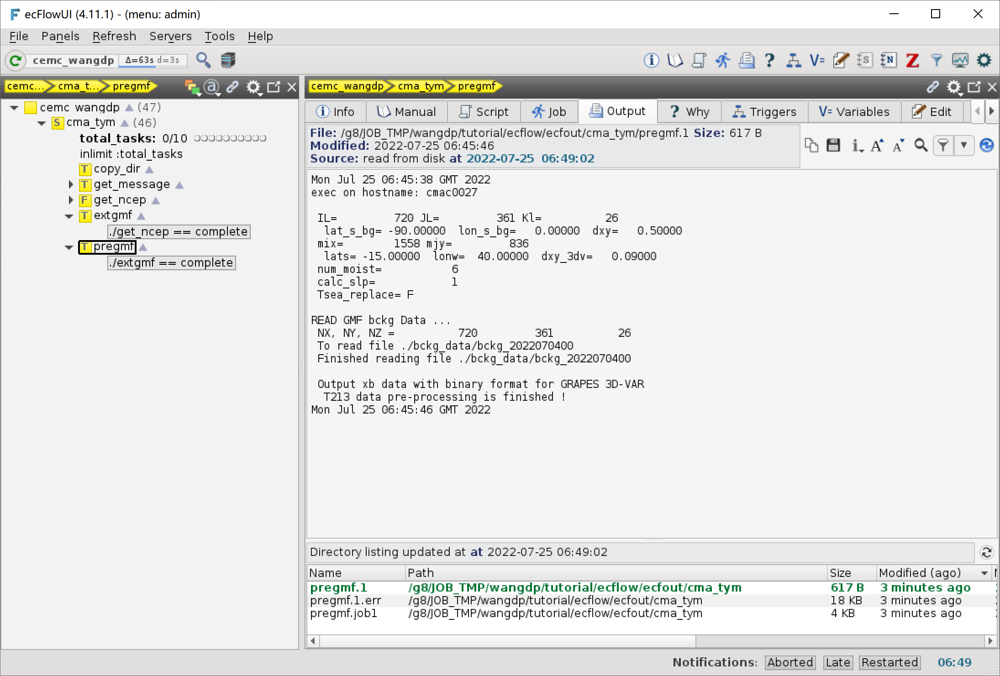

添加更多任务
=============

下面继续添加两个数据预处理任务：

- extgmf 任务解码全球模式资料，生成二进制文件
- pregmf 任务对解码后的全球模式资料进行预处理

修改工作流定义
--------------

更新 ``${TUTORIAL_HOME}/def`` 中的工作流定义文件 **cma_tym.py**：

.. code-block::
    :linenos:
    :emphasize-lines: 64-70

    import os

    import ecflow

    def slurm_serial(class_name="serial"):
        variables = {
            "ECF_JOB_CMD": "slsubmit6 %ECF_JOB% %ECF_NAME% %ECF_TRIES% %ECF_TRYNO% %ECF_HOST% %ECF_PORT%",
            "ECF_KILL_CMD": "slcancel4 %ECF_RID% %ECF_NAME% %ECF_HOST% %ECF_PORT%",
    	    "CLASS": class_name,
        }
        return variables

    current_path = os.path.dirname(__file__)
    tutorial_base = os.path.abspath(os.path.join(current_path, "../"))
    def_path = os.path.join(tutorial_base, "def")
    ecfout_path = os.path.join(tutorial_base, "ecfout")
    program_base_dir = os.path.join(tutorial_base, "program/grapes-tym-program")
    run_base_dir = os.path.join(tutorial_base, "workdir")

    defs = ecflow.Defs()

    with defs.add_suite("cma_tym") as suite:
        suite.add_variable("PROGRAM_BASE_DIR", program_base_dir)
        suite.add_variable("RUN_BASE_DIR", run_base_dir)

        suite.add_variable("ECF_INCLUDE", os.path.join(def_path, "include"))
        suite.add_variable("ECF_FILES", os.path.join(def_path, "ecffiles"))

        suite.add_variable("USE_GRAPES", ".false.")
        suite.add_variable("FORECAST_LENGTH", 120)
        suite.add_variable("GMF_TINV", 3)
        suite.add_variable("RMF_TINV", 3)
        suite.add_variable("USE_GFS", 12)

        suite.add_variable("ECF_DATE", "20220704")
        suite.add_variable("HH", "00")

        suite.add_limit("total_tasks", 10)
        suite.add_inlimit("total_tasks")

        with suite.add_task("copy_dir") as tk_copy_dir:
            pass

        with suite.add_task("get_message") as tk_get_message:
            tk_get_message.add_trigger("./copy_dir == complete")
            tk_get_message.add_variable(slurm_serial("serial"))
            tk_get_message.add_event("arrived")
            tk_get_message.add_event("peaceful")

        with suite.add_family("get_ncep") as fm_get_ncep:
            fm_get_ncep.add_trigger("./get_message == complete")
            fm_get_ncep.add_variable(slurm_serial("serial"))
            for hour in range(0, 120 + 1, 3):
                hour_string = "{hour:03}".format(hour=hour)
                with fm_get_ncep.add_task(hour_string) as tk_hour:
                    tk_hour.add_variable("FFF", hour_string)
                    tk_hour.add_variable(
                        "ECF_SCRIPT_CMD",
                        "cat {def_path}/ecffiles/getgmf_ncep.ecf".format(def_path=def_path)
                    )

        with suite.add_task("extgmf") as tk_extgmf:
            tk_extgmf.add_trigger("./get_ncep == complete")
            tk_extgmf.add_variable(slurm_serial("serial"))

        with suite.add_task("pregmf") as tk_pregmf:
            tk_pregmf.add_trigger("./extgmf == complete")
            tk_pregmf.add_variable(slurm_serial("serial"))

    print(defs)
    def_output_path = str(os.path.join(def_path, "cma_tym.def"))
    defs.save_as_defs(def_output_path)

65-70 行添加两个任务 extgmf 和 pregmf。

更新 ecFlow 上的工作流：

.. code-block:: bash

    cd ${TUTORIAL_HOME}/def/ecffiles
    python cma_tym.py
    ecflow_client --port 43083 --replace /cma_tym cma_tym.def

在 ecFlowUI 中可以通过 Force/complete 命令将多个节点设为 complete 状态：

创建任务脚本
-------------

在 ``${TUTORIAL_HOME}/def/ecffiles`` 目录下创建 ecf 脚本 **extgmf.ecf**：

.. code-block:: bash

    #!/bin/ksh
    %include <slurm_serial.h>
    %include <head.h>
    %include <configure.h>

    #=============================================

    RUN_DIR=${CYCLE_RUN_DIR}/bckg_data
    cd ${RUN_DIR}

    cp ${CYCLE_GMF_DIR}/data_proc/000/bckg.inc bckg.inc

    dobckg=1
    dopost=0
    doplot=0
    dodata=0
    upload=0

    ${PROGRAM_SCRIPT_DIR}/TcPro.pl \
      -B $dobckg \
      -P $dopost \
      -G $doplot \
      -M $dodata \
      -U $upload \
      -S ${COMPONENT_PROJECT_BASE} \
      -D ${CYCLE_RUN_BASE_DIR} \
      -f ${FORECAST_LENGTH} \
      -i ${RMF_TINV} \
      -I ${GMF_TINV} \
      ${START_TIME}

    #---------------------------------------
    %include <tail.h>

在 ``${TUTORIAL_HOME}/def/ecffiles`` 目录下创建 ecf 脚本 **pregmf.ecf**：

.. code-block:: bash

    #!/bin/ksh
    %include <slurm_serial.h>
    %include <head.h>
    %include <configure.h>
    #==============================

    RUN_DIR=${CYCLE_RUN_DIR}
    cd ${RUN_DIR}

    #===========================#
    rm -f namelist_xb
    rm -f xb${START_TIME}000.dat

    ${PROGRAM_SCRIPT_DIR}/do_xb.csh ${START_TIME}
    ${PROGRAM_BIN_DIR}/pre_xb.x

    #===========================#
    ${PROGRAM_SCRIPT_DIR}/xbctl.csh xb ${START_TIME} 000

    mv -f xb${START_TIME}000.dat ${CYCLE_VTX_DIR}
    mv -f xb${START_TIME}000.ctl ${CYCLE_VTX_DIR}
    mv -f Postvar.ctl ${CYCLE_VTX_DIR}

    #---------------------------------------
    %include <tail.h>

运行任务
---------

恢复节点 cma_tym，ecFlow 会自动运行后续任务。

