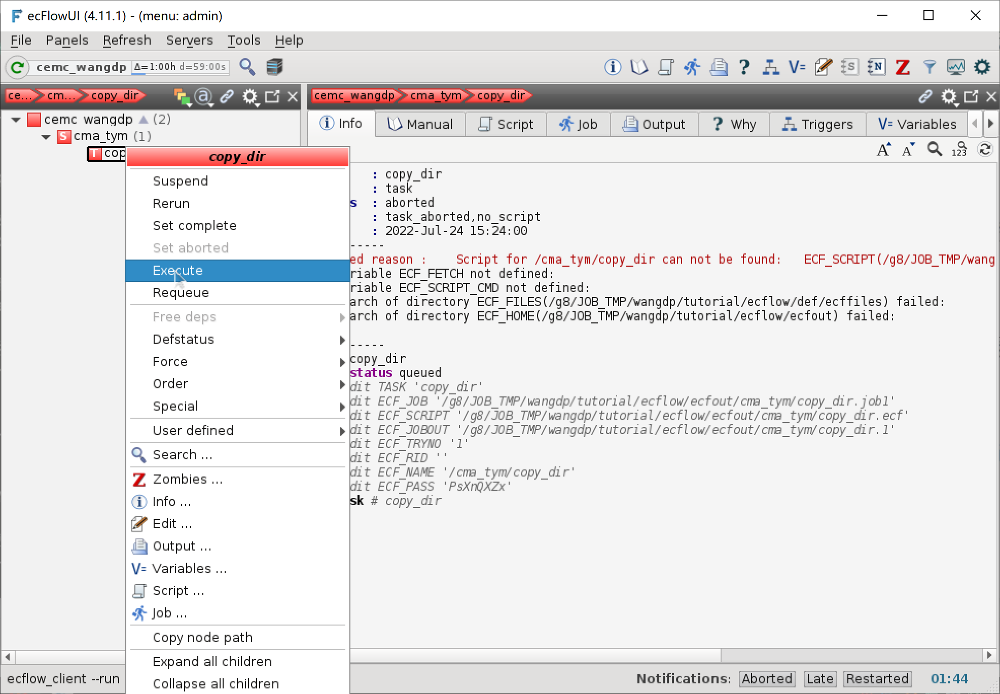
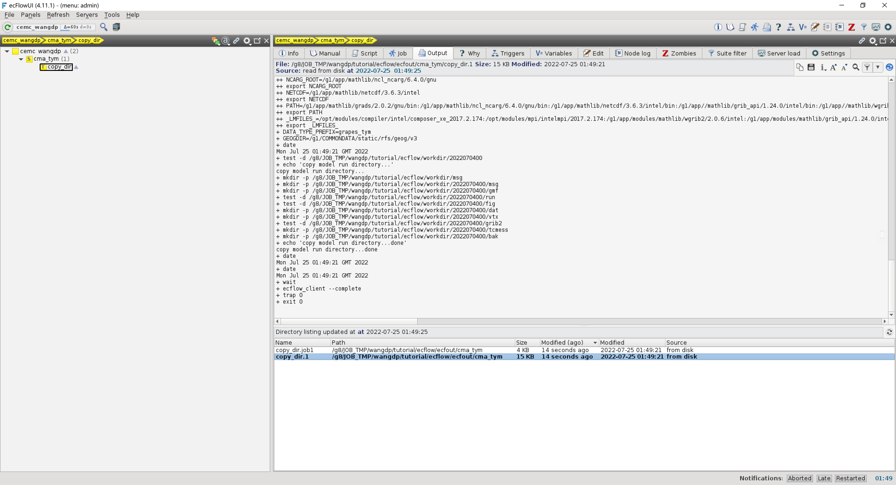

创建任务脚本
=============

下面我们为 copy_dir 任务编写任务脚本。
copy_dir 任务用于将运行模式需要的静态文件拷贝到运行目录。

编写 ecf 文件
--------------

在 ``${TUTORIAL_HOME}/def/ecffiles`` 目录中为 copy_dir 任务创建 ecf 脚本 **copy_dir.ecf**：

.. code-block:: bash

    #!/bin/bash
    %include <head.h>
    %include <configure.h>
    #--------------------------------------

    #-------------------
    # model run directory
    date

    test -d ${CYCLE_RUN_BASE_DIR} || mkdir -p ${CYCLE_RUN_BASE_DIR}

    # create dir
    echo "copy model run directory..."
    mkdir -p ${MSG_DIR}

    mkdir -p ${CYCLE_MSG_DIR}
    mkdir -p ${CYCLE_GMF_DIR}
    test -d ${CYCLE_RUN_DIR} || cp -R ${PROGRAM_CON_DIR}/grapes/run ${CYCLE_RUN_BASE_DIR}/
    test -d ${CYCLE_FIG_DIR} || cp -R ${PROGRAM_CON_DIR}/grapes/fig ${CYCLE_RUN_BASE_DIR}/
    mkdir -p ${CYCLE_DAT_DIR}
    mkdir -p ${CYCLE_VTX_DIR}
    test -d ${CYCLE_GRIB2_DIR} || cp -R ${PROGRAM_CON_DIR}/grib2 ${CYCLE_RUN_BASE_DIR}/
    mkdir -p ${CYCLE_TCMESS_DIR}
    mkdir -p ${CYCLE_BAK_DIR}

    echo "copy model run directory...done"

    date
    #---------------------------------------
    %include <tail.h>

运行任务
--------

有了任务脚本，就可以在在 ecFlowUI 中运行任务。

右键点击 copy_dir 节点，在弹出菜单中选择 Execute，手动运行任务 copy_dir。
因为我们重新运行了一个出错的作业，所以 ecFlowUI 会自动弹出 Restarted 窗口，列出重新启动的任务。

在 ecFlowUI 的 Output 标签中可以看到作业脚本和输出日志文件

