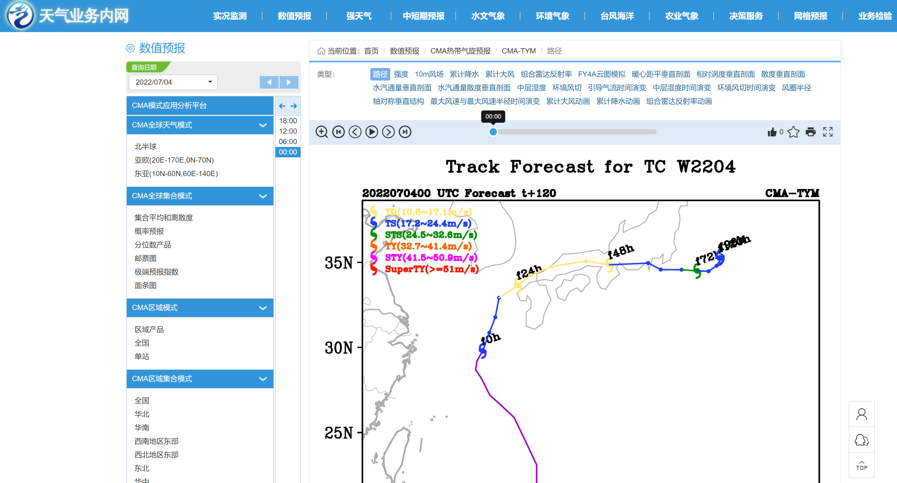

简介
===========

首先介绍使用的预报数据和实验环境。

预报数据
---------

运行 2022 年 7 月 4 日 00 时次 120 小时预报，该时次预报有 W2204 号台风。
下图是 `天气业务内网 <http://10.1.64.146/npt/>`_ 的网站截图，网页图片是该时次预报的台风路径图：

实验环境
-----------

使用 CMA-PI 高性能计算机搭建 ecFlow 流程，系统默认已将 ecFlow 程序包加入到环境变量 ``PATH`` 中，默认版本为 4.11.1。

使用 *wangdp* 用户登录 CMA-PI 科研分区的 *login_a09* 节点 (10.40.140.20)：

.. code-block:: bash

    ssh wangdp@10.40.140.20

查看 ecflow 版本：

.. code-block:: bash

    ecflow_client --version

.. code-block::

    Ecflow version(4.11.1) boost(1.53.0) compiler(gcc 4.8.5) protocol(TEXT_ARCHIVE) Compiled on Dec 25 2018 06:53:21

在开始之前，请检查 ``$HOME/bin`` 目录是否存在 ``slsubmit6`` 和 ``slcancel4`` 两个脚本。
如果脚本不存在或目录不存在，请创建 ``$HOME/bin`` 目录并拷贝这两个脚本：

.. warning::

    上述两个脚本为简化版，如果当前用户已有这两个脚本，请 **不要** 覆盖。

.. code-block:: bash

    mkdir -p ${HOME}/bin
    cd ${HOME}/bin
    cp /g11/wangdp/project/course/ecflow/2022/package/slcancel4 .
    cp /g11/wangdp/project/course/ecflow/2022/package/slsubmit6 .

检查 ``slsubmit6`` 是否可以被找到：

.. code-block:: bash

    which slsubmit6

如果输出类似

.. code-block::

    ~/bin/slsubmit6

则表示 ``slsubmit6`` 在环境变量 ``PATH`` 目录中。

如果没有输出结果，则需要检查环境变量 ``PATH`` 是否包含 ``~/bin`` 目录。