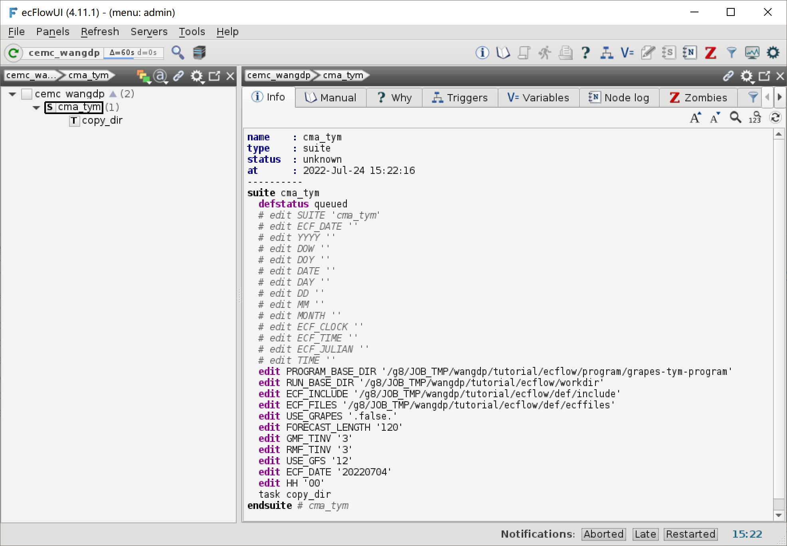
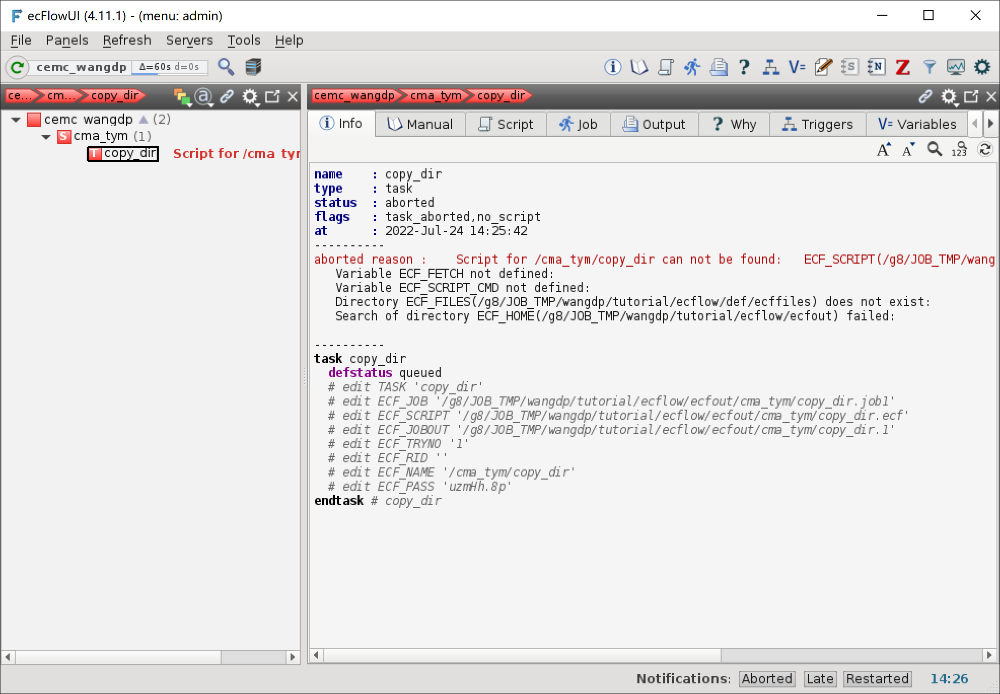

加载工作流
==========

下一步是让 ecFlow 服务知道我们的工作流，或者称为加载 suite 定义文件。

加载 suite
------------

使用 ecFlow 命令行客户端命令 ``ecflow_client`` 加载 suite 定义文件 **cma_tym.def**：

.. note::

    ``ecflow_client`` 命令需要指定 ecFlow 服务所在的主机和端口号。
    本教程在 ecFlow 服务所在节点运行 ``ecflow_client``，所以只需要指定端口号。

.. code-block:: bash

    cd ${TUTORIAL_HOME}/def
    ecflow_client --port 43083 --load cma_tym.def

.. note::

    如果设置了环境变量 ``ECF_PORT``，可以不用显式设置 ``--port`` 参数。

查看 suite
--------------

在 ecFlowUI 中可以看到刚加载的工作流处于 unknown 状态。

右键点击 cma_tym，单击 begin，可以启动 cma_tym 工作流。
因为我们没有设置任何触发器，所以 copy_dir 任务会立刻执行。
但因为我们还没编写任务脚本，ecFlow 会报错，ecFlowUI 会弹出一个窗口显示出错任务列表。
出错的任务处于 aborted 状态。

下面我们将开始为第一个任务编写任务脚本。