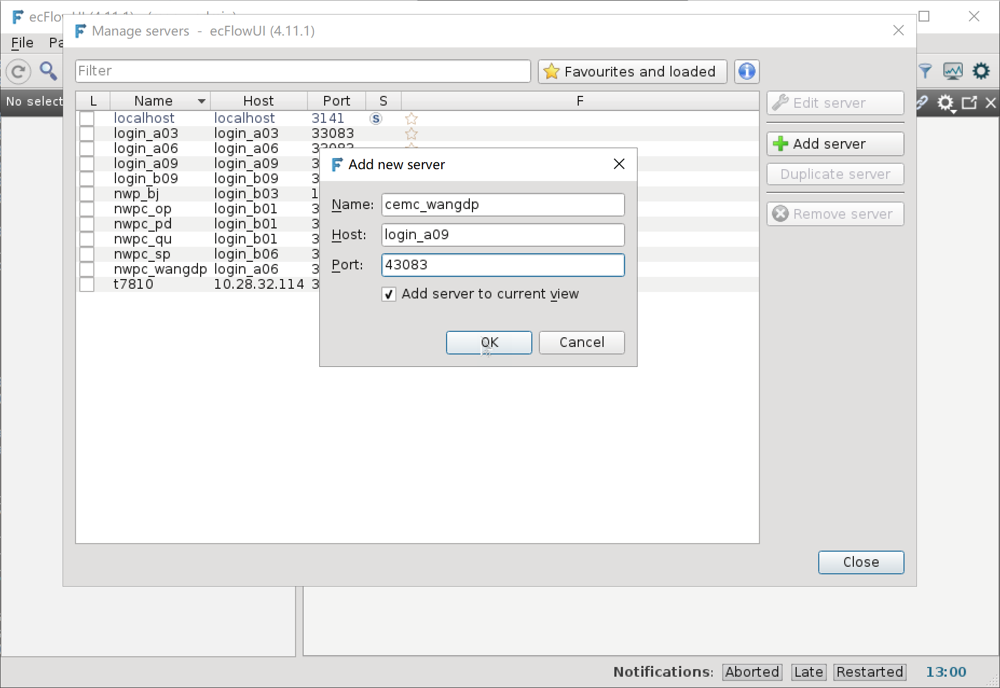
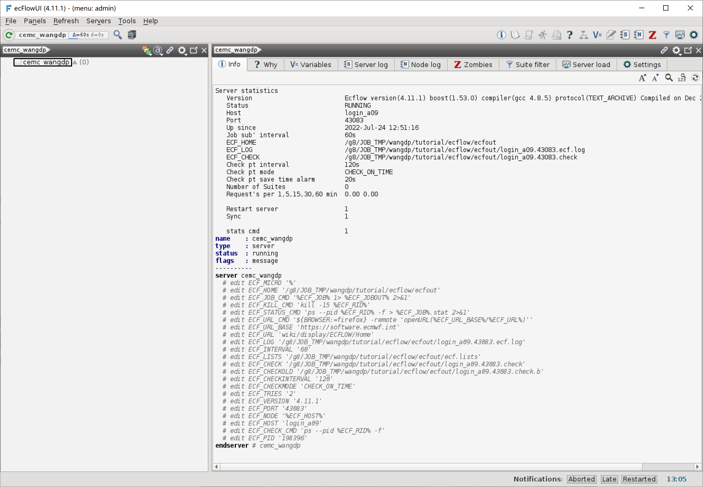

启动 ecFlow 服务
=================

在开始编写 ecFlow 工作流前，先让我们启动一个 ecFlow 服务。

选择端口号
----------

ecFlow 服务需要监听登录节点上的一个端口，启动 ecFlow 前需要先选择一个登录节点和一个端口号。
本教程选择登录节点 **login_a09** (登录IP：10.40.140.20)，并使用  **43083** 作为端口号。

.. warning::

    因后续任务会提交到 Slurm 队列上执行，所以必须选择可以提交作业的登录节点。

    比如 *wangdp* 用户仅能在科研分区上提交作业，所以只能选择 *login_a* 开头的登录节点。

使用域名登录会自动分配登录节点，为了提高效率，建议在创建 ecFlow 工作流时直接使用 IP 地址登录到 ecFlow 服务运行的登录节点。
比如本教程直接 10.40.140.20 登录 login_a09 节点。

建议使用比较大的端口号，比如本教程使用 *4 + 座机后四位* (4 + 3083) 作为端口号。

启动 ecFlow 服务
----------------

ecFlow 提供 ``ecflow_start.sh`` 脚本用于启动 ecFlow 服务。

查看 **ecflow_start.sh** 脚本的帮助信息：

.. code-block:: shell

    ecflow_start.sh --help

显示如下信息：

.. code-block::

    Usage: /g1/app/apps/ecflow/4.11.1/bin/ecflow_start.sh [-b] [-d ecf_home directory] [-f] [-h]
        -b        start ECF for backup server or e-suite
        -d <dir>  specify the ECF_HOME directory - default /g1/u/wangdp/ecflow_server
        -f        forces the ECF to be restarted
        -v        verbose mode
        -h        print this help page
        -p <num>  specify server port number(ECF_PORT number)  - default 1500+<UID> | 1000+<UID> for backup server

在 ``${TUTORIAL_HOME}/ecfout`` 目录中以后台方式运行 ecFlow 服务，端口号为 43083：

.. code-block:: bash

    cd ${TUTORIAL_HOME}/ecfout
    ecflow_start.sh -b -d ${TUTORIAL_HOME}/ecfout -p 43083

显示如下信息：

.. code-block::

    [12:51:15 24.7.2022] Request( --ping :wangdp ), Failed to connect to login_a09:43083. After 2 attempts. Is the server running ?

    login_a09 login_a09 33083
    login_a09,login_a09,33083,0,0
    Sun Jul 24 12:51:15 UTC 2022

    User "1021308" attempting to start ecf server on "login_a09" using ECF_PORT "43083" and with:
    ECF_HOME     : "/g8/JOB_TMP/wangdp/tutorial/ecflow/ecfout"
    ECF_LOG      : "login_a09.43083.ecf.log"
    ECF_CHECK    : "login_a09.43083.check"
    ECF_CHECKOLD : "login_a09.43083.check.b"
    ECF_OUT      : "/dev/null"

    client version is Ecflow version(4.11.1) boost(1.53.0) compiler(gcc 4.8.5) protocol(TEXT_ARCHIVE) Compiled on Dec 25 2018 06:53:21
    Checking if the server is already running on login_a09 and port 43083
    [12:51:16 24.7.2022] Request( --ping :wangdp ), Failed to connect to login_a09:43083. After 2 attempts. Is the server running ?

    Backing up check point and log files

    OK starting ecFlow server...

    Placing server into RESTART mode...

    To view server on ecflow_ui - goto Servers/Manage Servers... and enter
    Name        : <unique ecFlow server name>
    Host        : login_a09
    Port Number : 43083

以上信息表明 ecFlow 服务已正常启动。

.. note::

    如果出现错误信息，可能因为 ecFlow 已经启动或端口号已被占用。
    如果端口号已被占用，请选择一个新的端口号。

使用 ecFlowUI 检查 ecFlow 服务
--------------------------------

启动服务后，可以使用 ecFlowUI 检查 ecFlow 服务是否正常启动。

后台运行模式打开 ecFlowUI 界面：

.. code-block:: shell

    ecflow_ui &

点击 Servers/Manage servers... 菜单，在弹出窗口中点击 Add server 按钮，添加刚启动的 ecFlow 服务：

添加服务后，可以在界面查看 ecFlow 服务信息，请关注右侧 Info 面板的 Status、Host、Port、ECF_HOME 和 ECF_LOG 值：

